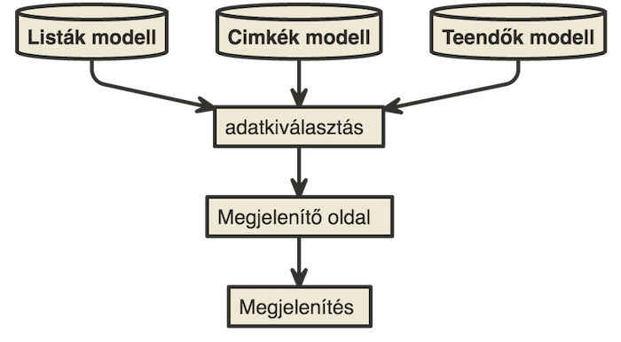
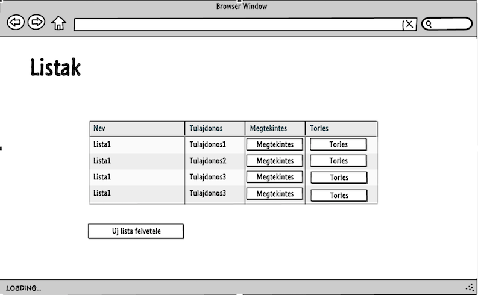
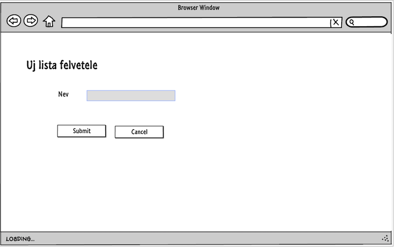
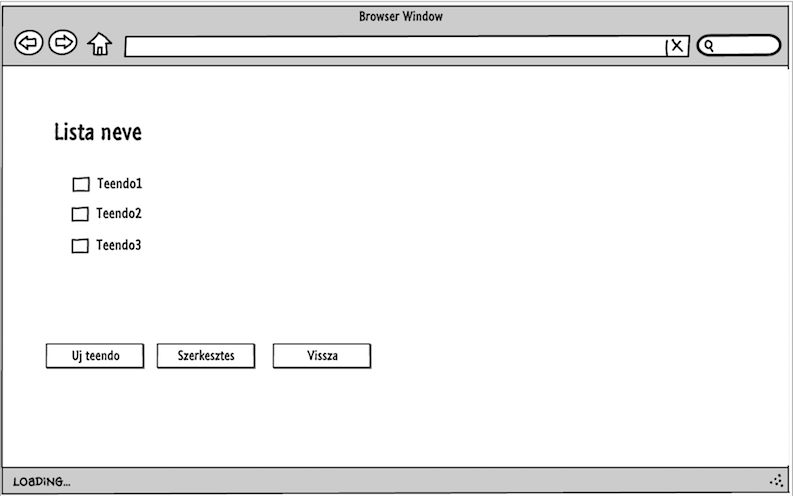

# Dokumentáció
##Családi todo
Készítette: Fazakas Loránd

###1.	Követelményanalízis
#####1.1.	Célkitűzés, projektindító dokumentum
A program célja egy könnyen kezelhető és praktikus családi teendő lista. Az adatok védelme érdekében lehetőség lesz regisztrációra, illetve bejelentkezésre. Bejelentkezett felhasználó a családja által létrehozott listákat és a lista elemeket megtekintheti, bővítheti, módosíthatja,törölheti. Ezeken kívűl a teendőkhöz címkét adhat hozzá és törölhet.

######Funkcionális követelmények:
* Regisztráció
* Bejelentkezés
* Csak bejelentkezett felhasználók által elérhető funkciók
  - új lista létrehozása
  - lista törlése
  - új teendő felvétele a listába
  - a meglévő teendők módosítása
  - a meglévő teendők törlése
  - címke hozzáadása teendőkhoz
  - címke törlése egy teendőből

######Nem funkcionális követelmények:
*	**Használhatóság:** Könnyű áttekinthetőség, ésszerű elrendezés, könnyen kezelhetőség
*	**Megbízhatóság:** jelszóval védett funkciók, és a jelszavak védelme a háttérben. Hibásan bevitt adatok esetén a program jól láthatóan jelezzen a felhasználónak, és emelje ki a hibás beviteli mezőket. A jól bevitt adatok maradjanak az űrlapban.
*	**Karbantarthatóság:** könnyen lehessen bővíteni, a különböző típusú fájlok külön csoportosítva, ésszerűen legyenek felbontva, a könnyebb fejleszthetőség miatt

#####1.2.	Szakterületi fogalomjegyzék
* **New To Do:** Új teendő
* **Todo list:** Teendő lista
* **Tag:** Címke

#####1.3.	Használatieset-modell, funkcionális követelmények

**Vendég**: Csak a publikus oldalakat éri el

*	Főoldal
*	Bejelentkezés
*	Regisztráció

**Bejelentkezett felhasználó**: A publikus oldalak elérésén felül egyéb funkciókhoz is hozzáfér.

* Új lista létrehozása
* Lista törlése
*	Új teendő felvétele
*	Meglévő teendők megtekintése
*	Meglévő teendő szerkesztése
*	Meglévő teendő törlése
* Címke hozzáadása teendőkhoz
* Címke törlése egy teendőből

Vegyünk példának egy egyszerű folyamatot:

**Meglévő teendő szerkesztése:**

1.	A felhasználó az oldalra érkezve, bejelentkezik vagy regisztrál
2.	Regisztráció után megtekintheti a listákat listázó oldalt, ahol kiválaszthatja a szerkeszteni kívánt listát.
3.	Megnyomja a „Megtekintés” feliratú gombot
4.	A megtekintés oldalon kiválaszthatja a „Szerkesztés” gombot
5.	Szerkesztés oldalon felviszi az új adatokat
6.	Submit gombra kattintva elmenti a változásokat

###2.	Tervezés

#####2.1.	Architektúra terv

######2.1.1. Komponensdiagram

######2.1.2. Oldaltérkép:

**Publikus:**
* Főoldal
* Bejelentkezés
* Regisztráció

**Bejelentkezett:**
* Főoldal
* Listaoldal
  * Új lista létrehozása
  * Lista törlése
  * Lista megtekintése
    * Teendő felvétele
    * Teendő törlése
    * Teendő szerkesztése
    * Címke hozzáadása
    * Címke törlése

######2.1.3. Végpontok

* GET/: főoldal
* GET/login: bejelentkező oldal
* POST/login: bejelentkező adatok felküldése
* GET/login/signup: regisztrációs oldal
* POST/login/signup: regisztrációs adatok felküldése
* GET/logout: kijelentkező oldal
* GET/lists/list: listak oldal
* GET/lists/new: új lista felvétele
* POST/lists/new: új lista felvételéhez szükséges adatok felküldése
* GET/lists/id: lista adatok
* GET/tags/id: címke adatok
* POST/tags/id: új címke felvitele
* GET/todoItem/new: új teendő felvétele
* POST/todoItem/new: új teendő felvételéhez szükséges adatok felküldése
* GET/todoItem/delete=id: teendő törlése
* GET/todoItem/edit=id: teendő módosítása
* POST/todoItem/edit=id: teendő módosítása, adatok felküldése

#####2.2. Felhasználói-felület modell

######2.2.1.Oldalvázlatok:
**Főoldal**

**Regisztrációs oldal**

**Bejelentkező oldal**

**Listaoldal**

**Új lista felvétele**

**Lista megtekintése**

**Új teendő felvétele**

######2.2.2.Designtervek (végső megvalósítás kinézete):

######2.2.3. Osztálymodell

 **Adatmodell**

 

 **Adatbázisterv**

 
######2.2.4.  Dinamikus működés

**Szekvenciadiagram**

 Vegyünk példának a regisztrációt, majd egy új elem felvételét, szerkesztését, törlését, mindezt szekvenciadiagrammon.

 

###3.	Implementáció

######3.1.1. Fejlesztőkörnyezet

 IDE: **Visual Studio Code**

 * _git add <fajlnev>_ paranccsal kiválaszthatunk egy fájlt verzionálásra, vagy _git add ._ paranccsal az összes fájlt kiválaszthatjuk
 * _git commit -m "commit"_ paranccsal lokalisan menthetjuk a valtoztatasokat. Az így megjelölt verziókhoz a későbbiekben visszatérhetünk, különbségüket megtekinthetjük.
 * _git push origin master_ paranccsal a lokális tárolóból feltölthetjük a tartalmat a Github-ra.
 * Végezetül a Github oldalán leellenőrizhetjük a munkánkat.

######3.1.2. Könyvtárstruktúra, funkciók

###4.	Tesztelés
#####4.1. Tesztelési környezetek
#####4.2. Egységteszt
#####4.3. Funkciónális teszetelés
#####4.4.Tesztesetek
###5.	Felhasználói dokumentáció

**Futtatáshoz szükséges operációs rendszer:** Tetszőleges operációs rendszer

**A futtatáshoz szükséges hardver:** Operációs rendszerek szerint megadva

**Egyéb követelmények:** Internet böngésző telepítése, JavaScript ajánlott

**Program használata:**

1. Böngészőben nyissuk meg a főoldalt
2. Jobb felső sarokban kattintsunk a Bejelentkezés feliratra
3. Bejelentkezés/Regisztráció után a Listak oldalra jutunk
4. Listak oldalon: Törlés gombra kattintva törölhetjük a listát
5. Listak oldalon: Megtekint gombra kattintva a megtekintés oldalra jutunk
6. Megtekintés oldalon található a szerkesztés gomb
7. Szerkesztés oldal: módosithatunk a teendok leirasan es cimkein
8. Megtekintés oldalon található a új teendő gomb
9. Új teendő oldal: megadhatjuk a teendő leirasat és címkéket is választhatunk neki
