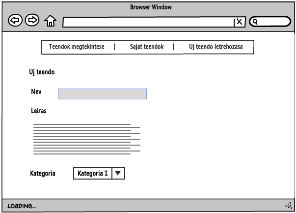
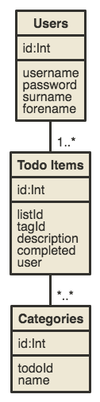

# Dokumentáció
##Családi todo
Készítette: Fazakas Loránd

###1.	Követelményanalízis
#####1.1.	Célkitűzés, projektindító dokumentum
A program célja egy könnyen kezelhető és praktikus családi teendő lista. Az adatok védelme érdekében lehetőség lesz regisztrációra, illetve bejelentkezésre. Bejelentkezett felhasználó a családja által létrehozott teendőket megtekintheti illetve a sajat teendőit bővítheti, módosíthatja, törölheti. Ezeken kívűl a teendőkhöz kategória is hozzárendelhető.

######Funkcionális követelmények:
* Regisztráció
* Bejelentkezés
* Csak bejelentkezett felhasználók által elérhető funkciók
  - új teendő létrehozása
  - teendő törlése
  - a meglévő teendők módosítása
  - a meglévő teendők törlése

######Nem funkcionális követelmények:
*	**Használhatóság:** Könnyű áttekinthetőség, ésszerű elrendezés, könnyen kezelhetőség
*	**Megbízhatóság:** jelszóval védett funkciók, és a jelszavak védelme a háttérben. Hibásan bevitt adatok esetén a program jól láthatóan jelezzen a felhasználónak, és emelje ki a hibás beviteli mezőket. A jól bevitt adatok maradjanak az űrlapban.
*	**Karbantarthatóság:** könnyen lehessen bővíteni, a különböző típusú fájlok külön csoportosítva, ésszerűen legyenek felbontva, a könnyebb fejleszthetőség miatt

#####1.2.	Szakterületi fogalomjegyzék
* **New To Do:** Új teendő
* **Category:** Kategória

#####1.3.	Használatieset-modell, funkcionális követelmények

**Vendég**: Csak a publikus oldalakat éri el

*	Főoldal
*	Bejelentkezés
*	Regisztráció

**Bejelentkezett felhasználó**: A publikus oldalak elérésén felül egyéb funkciókhoz is hozzáfér.

*	Új teendő létrehozása
*	Meglévő teendők megtekintése
*	Saját teendő szerkesztése
*	Saját teendő törlése

Vegyünk példának egy egyszerű folyamatot:

**Meglévő teendő szerkesztése:**

1.	A felhasználó az oldalra érkezve, bejelentkezik vagy regisztrál
2.	Regisztráció után megtekintheti a teendőket listázó oldalt, ahol kiválaszthatja a szerkeszteni kívánt teendőt.
3.	Rákattint a teendő nevére
4.	A megtekintés oldalon kiválaszthatja a „Szerkesztés” gombot
5.	Szerkesztés oldalon felviszi az új adatokat
6.	Submit gombra kattintva elmenti a változásokat

###2.	Tervezés

#####2.1.	Architektúra terv

######2.1.1. Komponensdiagram

######2.1.2. Oldaltérkép:

**Publikus:**
* Főoldal
* Bejelentkezés
* Regisztráció

**Bejelentkezett:**
* Teendők megtekintése
* Saját teendők megtekintése
  * Új teendő létrehozása
  * Teendő törlése
  * Teendő megtekintése
  * Teendő szerkesztése

######2.1.3. Végpontok

* GET/: teendők megtekintése oldal
* GET/login: bejelentkező oldal
* POST/login: bejelentkező adatok felküldése
* GET/register: regisztrációs oldal
* POST/register: regisztrációs adatok felküldése
* GET/logout: kijelentkező oldal
* GET/ownTodos/: saját todok megtekintése oldal
* GET/todos/create: új teendő felvétele
* POST/todos/create: új teendő felvételéhez szükséges adatok felküldése
* GET/todos/id: todo adatok
* GET/todos/id/delete: teendő törlése
* GET/todos/id/edit: teendő módosítása
* POST/todos/id/edit: teendő módosítása, adatok felküldése

#####2.2. Felhasználói-felület modell

######2.2.1.Oldalvázlatok:
**Főoldal**

**Regisztrációs oldal**

**Bejelentkező oldal**

**Új teendő felvétele**

**Teendők megtekintése**

**Teendő megtekintése**

######2.2.2.Designtervek (végső megvalósítás kinézete):

######2.2.3. Osztálymodell

 **Adatmodell**

 

 **Adatbázisterv**

 
######2.2.4.  Dinamikus működés

**Szekvenciadiagram**

 Vegyünk példának a regisztrációt, majd egy új elem felvételét, szerkesztését, törlését, mindezt szekvenciadiagrammon.

 

###3.	Implementáció

######3.1.1. Fejlesztőkörnyezet

 IDE: **Visual Studio Code**

 * _git add <fajlnev>_ paranccsal kiválaszthatunk egy fájlt verzionálásra, vagy _git add ._ paranccsal az összes fájlt kiválaszthatjuk
 * _git commit -m "commit"_ paranccsal lokalisan menthetjuk a valtoztatasokat. Az így megjelölt verziókhoz a későbbiekben visszatérhetünk, különbségüket megtekinthetjük.
 * _git push origin master_ paranccsal a lokális tárolóból feltölthetjük a tartalmat a Github-ra.
 * Végezetül a Github oldalán leellenőrizhetjük a munkánkat.

######3.1.2. Könyvtárstruktúra, funkciók

* **csaladitodo**
  * **controllers**
    * _TodoController.js_
    * _UserController.js_
  * **models**
    * _Todo.js_
    * _Category.js_
    * _Token.js_
    * _User.js_
  * **views**: njk fajlok
    * _layout.njk_
    * _login.njk_
    * _main.njk_
    * _master.njk_
    * _register.njk_
    * _todoCreate.njk_
    * _todoEdit.njk_
    * _todos.njk_
    * _todoShow.njk_

###4.	Tesztelés
 * Feltelepitjuk a Mozzila Firefox bongeszonkbe a Selenium IDE bovitmenyt.
 * A Selenium IDE-t megnyitva es majd a file/open-t kivalasztva a tests mappaban levo html fajlokat meg tudjuk nyitni.
 * Ezutan a zold nyillal lefuttathatjuk a tesztet.

#####4.1.Tesztesetek
* indexTest: fooldal megnyitasanak tesztje
* loginTest: bejelentkezes tesztje
* logoutTest: bejelentkezes majd kijelentkezes tesztje
* todoCreate: bejelentkezes majd uj teendo letrehozasanak a tesztje
* todoCreateAndDelete: bejelentkezes majd uj teendo letrehozasa es azon teendo torlese
* todoShowTest: Nappali todo megtekintese

###5.	Felhasználói dokumentáció

**Futtatáshoz szükséges operációs rendszer:** Tetszőleges operációs rendszer

**A futtatáshoz szükséges hardver:** Operációs rendszerek szerint megadva

**Egyéb követelmények:** Internet böngésző telepítése, JavaScript ajánlott

**Program használata:**

1. Böngészőben nyissuk meg a főoldalt
2. Jobb felső sarokban kattintsunk a Bejelentkezés feliratra
3. Bejelentkezés/Regisztráció után a Teendők megtekintése oldalra jutunk
4. Todok bongeszese oldalon: Egy teendő nevére rakattintva megtekinthetjuk a reszleteit
5. Megtekintés oldalon található a szerkesztés gomb
6. Szerkesztés oldal: módosithatunk a teendok neven, leirasan es kategoriajan. Mindegyiket kotelezo megadni ezt a rendszer ellenorzi
8. Todo letrehozasa oldal: megadhatjuk a teendő nevet,leirasat és címkéket is választhatunk neki
